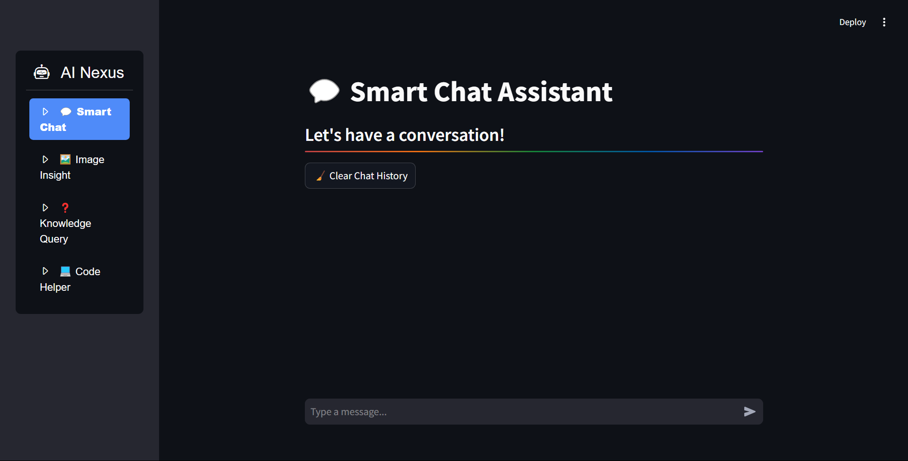
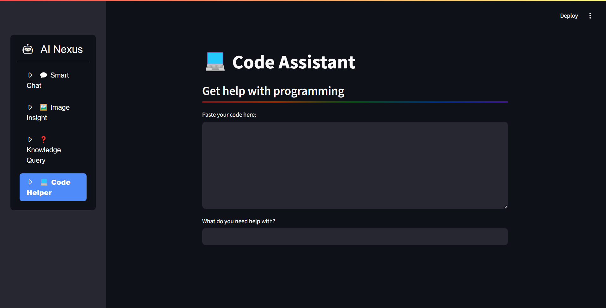
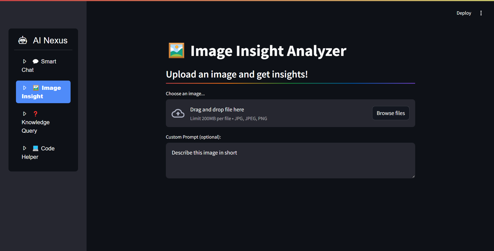

# AI Nexus

AI Nexus is a multi-functional chatbot offering Smart Chat, Image Insight, Knowledge Query, and Code Helper features. It is deployed as a Streamlit web application and leverages the Gemini 1.5 Pro model via the Gemini API.

## Features
- **Smart Chat:** Engage in interactive conversations with AI.
- **Image Insight:** Upload images to receive AI-generated insights.
- **Knowledge Query:** Get answers to factual and general knowledge queries.
- **Code Helper:** Receive programming assistance by pasting your code.

## Deployment
This application is built using Streamlit and deployed for seamless user interaction.

## Technology Stack
- **Frontend:** Streamlit
- **Backend:** Python
- **AI Model:** Gemini 1.5 Pro via Gemini API

## Screenshots





## How to Run
```bash
git clone https://github.com/21lakshh/AI-Nexus.git
pip install -r requirements.txt
streamlit run app.py
